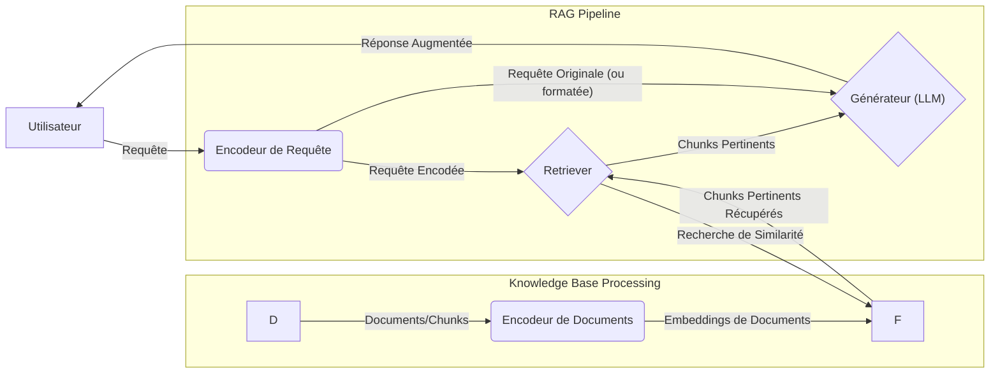

## 1. FONDAMENTAUX TECHNIQUES DU RAG

La Génération Augmentée par Récupération (Retrieval-Augmented Generation - RAG) est un paradigme d'intelligence artificielle qui améliore les capacités des Grands Modèles de Langage (LLM) en les connectant à des bases de connaissances externes. Cette approche permet de générer des réponses plus précises, factuelles et contextuellement pertinentes, en particulier pour des informations qui ne faisaient pas partie des données d'entraînement initiales du LLM ou qui évoluent rapidement. Le marché du RAG connaît une croissance rapide, avec une prévision de taux de croissance annuel composé (TCAC) de 44.7% de 2024 à 2030.

### 1.1. Architecture Détaillée : Composants Core (Retriever, Generator, Knowledge Base)

L'architecture RAG standard repose sur trois composants fondamentaux interdépendants : la Base de Connaissances (Knowledge Base), le Récupérateur (Retriever) et le Générateur (Generator).  

- **Base de Connaissances (Knowledge Base) :** Elle constitue le corpus d'informations externes sur lequel le système RAG va s'appuyer. Il peut s'agir d'une collection de documents (PDFs, pages web, articles), de bases de données structurées ou non structurées, ou de toute autre source d'information pertinente pour le domaine d'application. Pour être utilisable par le Retriever, cette connaissance est généralement prétraitée, segmentée en "chunks" (morceaux), et transformée en représentations vectorielles (embeddings) stockées dans une base de données vectorielle. La fraîcheur et la qualité de cette base sont cruciales pour la performance du RAG.  
    
- **Récupérateur (Retriever) :** Le Retriever a pour rôle de rechercher et d'extraire les informations les plus pertinentes de la Base de Connaissances en réponse à une requête utilisateur. Lorsqu'un utilisateur pose une question, celle-ci est d'abord transformée en un vecteur (embedding) en utilisant le même modèle d'embedding que celui utilisé pour la base de connaissances. Le Retriever compare ensuite ce vecteur de requête aux vecteurs des chunks stockés et sélectionne les "k" chunks les plus similaires, souvent en utilisant des métriques comme la similarité cosinus. Des algorithmes sophistiqués sont employés pour classer et sélectionner les informations les plus pertinentes et actuelles. Ce composant peut utiliser diverses méthodes de recherche, telles que la recherche par mots-clés, la recherche sémantique (basée sur les embeddings) ou une recherche hybride combinant les deux.  
    
- **Générateur (Generator) :** Le Générateur est typiquement un LLM (comme GPT, Llama, etc.). Il prend en entrée la requête originale de l'utilisateur ainsi que les chunks de contexte récupérés par le Retriever. Le LLM utilise alors ces informations contextuelles pour formuler une réponse cohérente, informative et ancrée dans les faits extraits. Le prompt fourni au Générateur est soigneusement conçu pour l'instruire d'utiliser le contexte fourni pour répondre à la question.  
    


Un composant additionnel, souvent implicite ou intégré, est l'**Encodeur (Encoder)**, qui transforme la requête utilisateur en un format vectoriel compréhensible par le Retriever et potentiellement par le Générateur, assurant une communication fluide entre les composants. Une  

**Couche d'Intégration (Integration Layer)** coordonne les interactions entre le Retriever et le Générateur pour un fonctionnement harmonieux du système.


**Diagramme Conceptuel de l'Architecture RAG :**





*Légende : Ce schéma illustre le flux d'une requête utilisateur à travers les composants d'un système RAG, depuis l'encodage initial jusqu'à la génération de la réponse augmentée.* 

Différents types d'architectures RAG existent, comme le **RAG Séquence**, où la récupération et la génération sont deux étapes distinctes, et le **RAG Token**, où la récupération et la génération peuvent se produire simultanément au niveau du token pour une précision accrue.[1] Le **Hybrid RAG** combine des éléments des deux, utilisant des composants modulaires pour une flexibilité opérationnelle.[1] Le **Native RAG** et les pipelines modulaires permettent une personnalisation et un réglage fin des composants.[1]

### 1.2. Mécanismes de Fonctionnement : Pipeline Complet de la Requête à la Génération

Le pipeline RAG typique, souvent appelé "Naive RAG" [3], se déroule en plusieurs étapes séquentielles :

1. **Ingestion et Indexation des Données (Pré-calcul) :** 
	* **Chargement des Données :** Les documents provenant de diverses sources sont chargés. * **Segmentation (Chunking) :** Les documents sont divisés en morceaux plus petits (chunks).[3] Cette étape est cruciale car la taille et la nature des chunks influencent directement la qualité de la récupération. 
	* **Encodage (Embedding) :** Chaque chunk est transformé en une représentation vectorielle (embedding) à l'aide d'un modèle d'embedding (ex: OpenAI Ada, Sentence-BERT).[3] 
	* **Stockage et Indexation :** Ces embeddings de chunks, ainsi que les chunks de texte originaux et leurs métadonnées, sont stockés et indexés dans une base de données vectorielle (ex: Pinecone, FAISS, Chroma).[3] L'indexation permet une recherche rapide de similarité.

Ce pipeline en deux étapes (récupération puis génération) permet aux systèmes RAG de fournir des réponses précises et contextuellement sensibles.[6]

### 1.3. Différences avec les LLM Classiques : Avantages, Limitations, Cas d'Usage

Les systèmes RAG se distinguent des LLM classiques (qui reposent uniquement sur leurs connaissances paramétriques acquises lors de l'entraînement) par plusieurs aspects :

**Avantages du RAG :**

* **Réduction des Hallucinations :** En ancrant les réponses sur des informations externes vérifiables, RAG diminue significativement la tendance des LLM à générer des informations incorrectes ou inventées ("hallucinations").[1, 3, 6] 
* **Accès à des Connaissances à Jour :** Les LLM classiques ont des connaissances figées à la date de fin de leur entraînement. RAG permet d'accéder à des informations en temps réel ou très récentes en mettant simplement à jour la base de connaissances externe, sans nécessiter un réentraînement coûteux du LLM.[2, 3, 6] 
* **Spécificité au Domaine et Personnalisation :** RAG permet d'adapter facilement un LLM généraliste à des domaines spécifiques (ex: médical, juridique, financier) en lui fournissant une base de connaissances spécialisée.[6] Cela permet également une personnalisation des réponses. 
* **Transparence et Explicabilité (Attribution) :** Les systèmes RAG peuvent souvent citer les sources d'information utilisées pour générer une réponse, ce qui augmente la confiance et permet la vérification.[7] 
* **Coût-Efficacité (par rapport au fine-tuning constant) :** Mettre à jour une base de connaissances est généralement moins coûteux et plus rapide que de réentraîner ou de fine-tuner un LLM entier pour incorporer de nouvelles informations.[1, 5] 
* **Meilleure Gestion des Requêtes Complexes :** RAG peut décomposer des requêtes complexes et récupérer des informations pertinentes pour chaque sous-partie, puis les synthétiser.[6]

**Limitations du RAG :**

* **Dépendance à la Qualité de la Récupération :** Si le Retriever échoue à trouver des documents pertinents ou ramène des informations bruitées/incorrectes, la qualité de la génération sera impactée (principe "garbage in, garbage out").[8] Une faible précision ou un faible rappel dans la récupération sont des limitations du RAG naïf.[3] 
* **Complexité de l'Architecture :** La mise en place d'un système RAG implique plusieurs composants (encodeur, base de données vectorielle, retriever, générateur) qui doivent être correctement configurés et optimisés. 
* **Latence Additionnelle :** L'étape de récupération ajoute une latence par rapport à un appel direct à un LLM.[8] 
* **Défis du Chunking :** La manière dont les documents sont segmentés (chunking) peut affecter la pertinence des informations récupérées. Des chunks trop petits peuvent manquer de contexte, tandis que des chunks trop grands peuvent contenir du bruit.[3] 
* **Gestion des Connaissances Contradictoires :** Si la base de connaissances contient des informations contradictoires, le LLM peut avoir du mal à générer une réponse cohérente. 
* **Sécurité :** Bien que RAG puisse réduire les hallucinations, il peut introduire de nouveaux risques de sécurité si les documents récupérés sont malveillants ou si le système est vulnérable aux attaques par injection dans la base de connaissances (corpus poisoning) ou dans les prompts.[7] Une étude récente (Avril 2024) a montré que RAG peut rendre les modèles moins sûrs, même avec des documents sûrs, en modifiant leur profil de sécurité.[7]

**Comparaison RAG vs. Fine-tuning LLM :** 
* **RAG :** Augmente le LLM avec des connaissances externes au moment de l'inférence. Ne modifie pas les poids du LLM. Idéal pour les connaissances dynamiques, la factualité et la transparence. Moins coûteux pour les mises à jour de connaissances. 
* **Fine-tuning :** Adapte les poids du LLM à un domaine ou une tâche spécifique en le réentraînant sur un dataset spécialisé. Modifie le comportement intrinsèque du LLM. Utile pour enseigner au LLM de nouveaux styles, formats, ou des connaissances très spécifiques qui doivent être internalisées. Peut être coûteux et chronophage.[6, 9]

RAG et le fine-tuning ne sont pas mutuellement exclusifs et peuvent être combinés : un LLM fine-tuné peut être utilisé comme générateur dans un système RAG pour améliorer encore plus la performance sur des tâches spécifiques.[1, 6]

**Cas d'Usage Typiques du RAG :**

* **Systèmes de Questions-Réponses (Q&A) sur des documents spécifiques :** (ex: manuels techniques, rapports internes, bases de connaissances d'entreprise).[10] 
* **Chatbots avec accès à des informations à jour :** (ex: support client, assistants virtuels).[10] 
* **Génération de contenu factuel :** (ex: résumés de recherche, rapports basés sur des données récentes). 
* **Applications nécessitant de la transparence et des sources citées.** 
* **Domaines où les informations évoluent rapidement** (ex: finance, actualités).


### 1.4. Métriques d'Évaluation : RAGAS, Faithfulness, Answer Relevancy, Context Precision/Recall 
Évaluer un système RAG est complexe car il combine un composant de récupération et un composant de génération. L'évaluation doit donc porter sur les deux aspects ainsi que sur leur interaction.[5] 
**Métriques Fondamentales (souvent regroupées sous le terme "RAG Triad" ou similaires) [5, 11]:**

1. **Pour la Génération :** 
	* **Faithfulness (Fidélité) / Groundedness (Ancrage) :** 
		* *Définition :* Mesure si la réponse générée est factuellement exacte et soutenue par le contexte récupéré.[5, 11, 12] Elle vise à s'assurer que le modèle n'hallucine pas et ne génère que des réponses véridiques basées sur le contexte fourni.[5] 
		* *Calcul (conceptuel) :* Compare la réponse générée avec les documents récupérés pour vérifier la cohérence factuelle. RAGAS demande au LLM si le contenu de la réponse peut être inféré du contexte donné.[11] La "groundedness" de la RAG Triad se limite à un chevauchement d'informations plus objectif entre le contexte et la réponse.[11] 
		* *Importance :* Crucial pour la fiabilité et la confiance dans le système RAG. 
	* **Answer Relevancy (Pertinence de la Réponse) :** 
		* *Définition :* Évalue dans quelle mesure la réponse générée est pertinente par rapport à la requête initiale de l'utilisateur.[5, 11, 12] 
		* *Calcul (conceptuel) :* RAGAS utilise une approche complexe impliquant la rétro-ingénierie de variantes de la question originale à partir de la réponse générée, puis évalue la similarité cosinus des embeddings de ces questions générées avec la requête originale.[11] L'approche de la RAG Triad compare plus directement la réponse générée avec la requête originale.[11] 
		* *Importance :* Assure que le système répond réellement à la question posée.
2. **Pour la Récupération :** 
* **Context Precision (Précision du Contexte) :** 
	* *Définition :* Mesure la proportion d'informations pertinentes parmi les chunks de contexte récupérés. C'est le rapport signal/bruit du contexte récupéré.[5, 11, 12] 
	* *Calcul (conceptuel) :* `Context Precision@K = (Nombre de chunks pertinents parmi les K récupérés) / K`.[5] RAGAS évalue combien de contexte récupéré est réellement pertinent pour la réponse.[5] 
	* *Importance :* Un contexte trop bruité (faible précision) peut dégrader la qualité de la génération. 
* **Context Recall (Rappel du Contexte) :** 
	* *Définition :* Mesure si le contexte récupéré contient toutes les informations nécessaires pour répondre à la question de manière exhaustive.[5, 11, 12] 
	* *Calcul (conceptuel) :* `Context Recall = (Nombre de phrases de la vérité terrain présentes dans le contexte récupéré) / (Nombre total de phrases dans la réponse vérité terrain)`.[5] RAGAS s'appuie sur le LLM pour identifier les déclarations dans la réponse générée et déterminer si chaque morceau de contexte contient les informations nécessaires pour produire ces déclarations.[11] 
	* *Importance :* Un faible rappel signifie que des informations cruciales peuvent manquer, conduisant à des réponses incomplètes. 
* **Context Relevancy (Pertinence du Contexte - global) :** 
	* *Définition :* Mesure l'utilité globale et l'alignement du contexte récupéré avec la réponse attendue ou la requête.[5, 12] C'est une mesure équilibrée qui prend en compte à la fois la précision et le rappel du contexte.[5] 
	* *Importance :* Donne une vision holistique de la qualité de la récupération.
	
**Framework RAGAS (Retrieval Augmented Generation Assessment) [11, 12, 13]:**
RAGAS est une boîte à outils populaire pour évaluer les systèmes RAG, en se concentrant sur les composants de récupération et de génération, à la fois isolément et conjointement.[12] Il adopte une approche de développement piloté par les métriques (MDD).

* **Composants de RAGAS [12] :** 
	* *Prompt object* (Objet Prompt) : Définit la structure des prompts. 
	* *Evaluation Sample* (Échantillon d'Évaluation) : Instance de données avec requête, réponse générée, et réponse de référence (vérité terrain). 
	* *Evaluation dataset* (Jeu de Données d'Évaluation) : Ensemble d'échantillons pour une évaluation systématique.
	
* **Métriques Clés de RAGAS [11, 12] :** 
	* **Faithfulness :** (voir ci-dessus) 
	* **Answer Relevancy :** (voir ci-dessus) 
	* **Context Precision :** (voir ci-dessus) 
	* **Context Recall :** (voir ci-dessus) 
	* **Context Utilization [12] :** Évalue dans quelle mesure le système RAG utilise efficacement le contexte récupéré pour générer sa réponse. Même avec une excellente récupération, un mauvais générateur peut ne pas l'utiliser efficacement.
	
* **Score RAGAS Global :** Les métriques individuelles sont combinées (souvent par une moyenne pondérée après normalisation) pour donner un score global quantifiant la performance du système RAG.[12] 

* **Comparaison RAGAS vs. RAG Triad [11] :** 
	* La RAG Triad (Answer Relevance, Context Relevance, Groundedness) est considérée comme plus interprétable. 
	* La "Faithfulness" de RAGAS peut être trompeuse si la connaissance interne du LLM évaluateur n'est pas alignée avec le domaine cible, tandis que la "Groundedness" de la Triade se concentre sur un chevauchement d'informations plus objectif. 
	* L'"Answer Relevancy" de RAGAS est plus complexe à calculer que celle de la Triade. * Le "Context Recall" de RAGAS peut être difficile pour les petits LLM.
	
**Implémentation de RAGAS [13] :** Bien que [13] utilise Opik, le principe est similaire pour d'autres intégrations.
	1. Définir la métrique RAGAS (ex: `AnswerRelevancy`). 
	2. Créer un wrapper pour la métrique afin de l'intégrer à la plateforme d'évaluation. 
	3. Utiliser ce wrapper dans la plateforme.

```python 
# Exemple conceptuel d'utilisation de RAGAS [13] 
# 1. Définir la métrique RAGAS 
from ragas.metrics import answer_relevancy 
from langchain_openai.chat_models import ChatOpenAI from langchain_openai.embeddings 
import OpenAIEmbeddings from ragas.llms import LangchainLLMWrapper from ragas.embeddings import LangchainEmbeddingsWrapper 
# Initialiser la métrique RAGAS 
llm_wrapper = LangchainLLMWrapper(ChatOpenAI(model_name="gpt-3.5-turbo")) 
embeddings_wrapper = LangchainEmbeddingsWrapper(OpenAIEmbeddings(model="text-embedding-ada-002")) 
ragas_answer_relevancy =answer_relevancy.AnswerRelevancy(llm=llm_wrapper, embeddings=embeddings_wrapper) 
# Supposons que nous ayons un 'dataset' au format attendu par RAGAS 
# (dictionnaires avec 'question', 'answer', 'contexts', 'ground_truth') 
from datasets import Dataset 
data_samples = { 
   'question': ['What is the capital of France?'], 
   'answer': ['Paris is the capital of France.'], 
   'contexts': [['Paris is the capital and most populous city of France...']], 
   'ground_truth': ['Paris'] # ou la réponse attendue complète 
 } 
dataset = Dataset.from_dict(data_samples)

from ragas import evaluate 
 result = evaluate( 
   dataset = dataset, 
   metrics=[ 
     ragas_answer_relevancy, 
 
     #... autres métriques comme faithfulness, context_precision, context_recall 
   ], 
 ) 
 print(result)
```


Note : Le code ci-dessus est conceptuel et simplifié. La préparation du dataset et l'appel exact à `evaluate` peuvent varier.

Autres métriques à considérer :  

- Retrieval accuracy (Précision de la récupération)
- Response time (Temps de réponse)
- Data freshness (Fraîcheur des données)
- Vector similarity analysis (Analyse de similarité vectorielle)
    
L'évaluation des systèmes RAG nécessite une approche multidimensionnelle, couvrant à la fois la qualité de l'information récupérée et la pertinence/factualité de la réponse générée. Des frameworks comme RAGAS fournissent un ensemble structuré de métriques pour cette tâche complexe.


## 2. CHUNKING ET SEGMENTATION AVANCÉE

Le "chunking" ou la segmentation est le processus de division de documents volumineux en morceaux plus petits et gérables, appelés "chunks". Cette étape est fondamentale dans le pipeline RAG car elle détermine les unités d'information qui seront encodées en embeddings et récupérées pour fournir un contexte au LLM. Une stratégie de chunking inefficace peut conduire à des résultats de recherche imprécis ou à l'omission d'informations pertinentes.

### 2.1. Stratégies de Chunking : Fixed-size, Semantic, Sentence-based, Recursive

Plusieurs stratégies de chunking existent, chacune avec ses avantages et inconvénients :

- **Fixed-size Chunking (Découpage à Taille Fixe) :**
    
    - _Description :_ L'approche la plus simple où le texte est divisé en chunks d'un nombre fixe de tokens (ou caractères), avec éventuellement un chevauchement (overlap) entre les chunks consécutifs.  
    - _Avantages :_ Facile à implémenter.
    - _Inconvénients :_ Peut couper des phrases ou des idées au milieu, perdant ainsi le contexte sémantique. Ne respecte pas la structure logique du document.
    - _Exemple de code (conceptuel) :_
```python
    def fixed_size_chunking(text, chunk_size, overlap_size):
    tokens = text.split() # Simplifié, utiliser un vrai tokenizer
    chunks =
    for i in range(0, len(tokens), chunk_size - overlap_size):
        chunk = " ".join(tokens[i:i + chunk_size])
        chunks.append(chunk)
    return chunks
```

* ***Recursive Chunking (Découpage Récursif) :**

	- _Description :_ Divise le texte de manière hiérarchique et itérative en utilisant une liste de séparateurs (par exemple, `\n\n` (paragraphes), puis `\n` (lignes), puis `.` (phrases), puis (mots)). Si un chunk initial est trop grand avec un séparateur, la méthode essaie récursivement avec le séparateur suivant dans la liste jusqu'à ce que la taille désirée soit atteinte. C'est une méthode courante et souvent recommandée dans LangChain.  
	- _Avantages :_ Tente de maintenir la cohérence sémantique en essayant de couper aux limites naturelles du texte. Plus adaptable que le fixed-size.
	- _Inconvénients :_ Peut encore produire des coupures maladroites si les séparateurs ne correspondent pas bien à la structure du texte.
	- _Exemple de code (LangChain) :_

```python
from langchain.text_splitter import RecursiveCharacterTextSplitter

document_text = "Votre long texte ici...\n\nAvec plusieurs paragraphes.\nEt des phrases."
# Exemple de séparateurs communs, l'ordre est important
splitter = RecursiveCharacterTextSplitter(
    chunk_size=500,  # Taille maximale des chunks en nombre de caractères
    chunk_overlap=50, # Chevauchement entre les chunks
    separators=["\n\n", "\n", ".", " ", ""] # Liste des séparateurs à essayer
)
chunks = splitter.split_text(document_text)
print(f"Nombre de chunks: {len(chunks)}")
for i, chunk in enumerate(chunks):
     print(f"Chunk {i+1}: {chunk[:100]}...") # Affiche le début de chaque chunk
```


* ***Sentence-based Chunking (Découpage Basé sur les Phrases) :**

	- _Description :_ Divise le texte en phrases individuelles, en utilisant des bibliothèques NLP comme NLTK ou spaCy pour la segmentation des phrases.
	- _Avantages :_ Les phrases sont souvent des unités sémantiques cohérentes. Simple à comprendre.
	- _Inconvénients :_ Les phrases individuelles peuvent manquer de contexte suffisant pour des requêtes complexes. Peut générer un très grand nombre de petits chunks.
	- _Exemple de code (avec NLTK) :_

```python
import nltk
# nltk.download('punkt') # Nécessaire une seule fois

def sentence_chunking(text):
    sentences = nltk.sent_tokenize(text)
    return sentences
```


* ***Semantic Chunking (Découpage Sémantique) :**

	- _Description :_ Vise à diviser le texte en fonction de la cohérence sémantique, en créant des ruptures lorsque le sujet ou le thème change de manière significative.  
	- Mécanisme :  
	    1. Diviser le document en phrases.
	    2. Pour chaque phrase, créer un "groupe de phrases" en incluant cette phrase et quelques phrases environnantes (avant et après). Ce groupe est "ancré" par la phrase centrale.
	    3. Générer des embeddings pour chaque _groupe de phrases_ (pas pour les phrases individuelles). L'embedding est associé à sa phrase d'ancrage.
	    4. Comparer les distances sémantiques (par exemple, similarité cosinus inversée) entre les embeddings des groupes de phrases séquentiels. Une distance sémantique élevée entre le groupe de la phrase `i` et celui de la phrase `i+1` indique un changement de thème. Ce point est alors une potentielle limite de chunk.
	        
	- _Avantages :_ Produit des chunks sémantiquement cohérents et auto-contenus, ce qui peut améliorer la pertinence de la récupération.
	- _Inconvénients :_ Plus complexe à implémenter et potentiellement plus coûteux en calcul (nécessite des embeddings pendant le processus de chunking). Le choix du seuil de distance pour couper est critique.
	- _Implémentations :_ LangChain et LlamaIndex proposent des implémentations de semantic chunking. LangChain permet de définir des seuils de rupture en utilisant des percentiles, des écarts-types ou des intervalles interquartiles des distances de similarité.  
	- _Exemple de code (conceptuel avec LangChain `SemanticChunker`) :_

```python
from langchain_experimental.text_splitter import SemanticChunker
from langchain_openai import OpenAIEmbeddings # Ou autre modèle d'embedding

# Nécessite un modèle d'embedding pour calculer la similarité sémantique
embeddings_model = OpenAIEmbeddings(model="text-embedding-3-small")

# Le SemanticChunker utilise un modèle d'embedding pour trouver les ruptures sémantiques.
# 'breakpoint_threshold_type' peut être "percentile", "standard_deviation", "interquartile"
semantic_splitter = SemanticChunker(
    embeddings_model,
    breakpoint_threshold_type="percentile", # ou "standard_deviation", "interquartile"
    # breakpoint_threshold_amount=0.95 # Pour percentile, par ex.
)
document_text = "Texte long avec des changements de sujet. Le premier sujet parle de chats. Les chats sont des animaux domestiques populaires. Puis le sujet change pour les chiens. Les chiens sont aussi de bons compagnons."
chunks = semantic_splitter.create_documents([document_text])
for chunk in chunks:
     print(chunk.page_content)
     print("---")
```


* ***Specialized Chunking (Markdown, LaTeX) :**

	- _Description :_ Tire parti de la structure inhérente des formats de documents comme Markdown ou LaTeX. Par exemple, en Markdown, les divisions peuvent se faire en fonction des titres (`#`, `##`), des listes, ou des blocs de code. En LaTeX, selon les sections, sous-sections, ou équations.  
	- _Avantages :_ Préserve la structure logique du document, conduisant à des chunks plus cohérents sémantiquement et contextuellement pertinents.  
	- _Inconvénients :_ Spécifique au format du document. Nécessite des parseurs adaptés.
	
Le choix de la stratégie de chunking est une étape critique et souvent sous-estimée, ayant un impact direct sur la qualité du contexte récupéré et, par conséquent, sur la performance globale du système RAG.


### 2.2. Paramètres Optimaux : Taille des Chunks, Overlap, Trade-offs

L'optimisation des paramètres de chunking est essentielle pour maximiser l'efficacité d'un système RAG. Les deux paramètres principaux sont la taille des chunks et le chevauchement (overlap).

- **Taille des Chunks (Chunk Size) :**
    
    - La taille optimale d'un chunk n'est pas universelle. Elle dépend de plusieurs facteurs :  
        
        - **Nature du contenu :** Des documents denses et techniques peuvent nécessiter des chunks plus grands pour conserver le sens, tandis que des contenus plus courts (comme des messages instantanés) se prêtent à des chunks plus petits.
        
        - **Modèle d'embedding utilisé :** Certains modèles d'embedding ont des performances optimales avec des tailles de chunk spécifiques. Par exemple, `text-embedding-ada-002` d'OpenAI fonctionne bien avec des chunks contenant 256 ou 512 tokens. D'autres, comme les modèles  
            
            `sentence-transformer`, sont optimisés pour des phrases individuelles.
            
        - **Complexité attendue des requêtes utilisateur :** Si les requêtes sont courtes et spécifiques, des chunks plus petits et ciblés peuvent être préférables. Pour des requêtes longues et complexes, des chunks plus grands avec plus de contexte peuvent être nécessaires.
            
        - **Utilisation des résultats récupérés :** Si les chunks récupérés doivent être passés à un LLM générateur ayant une limite de tokens stricte, la taille des chunks doit être gérée en conséquence pour ne pas dépasser cette limite lorsque plusieurs chunks sont concaténés.  
            
    - _Compromis :_
        
        - **Chunks trop petits :** Peuvent manquer de contexte suffisant pour que l'embedding capture fidèlement le sens, ou pour que le LLM génère une réponse complète. Risque de fragmenter une idée cohérente sur plusieurs chunks, dont tous pourraient ne pas être récupérés.
            
        - **Chunks trop grands :** Peuvent contenir trop d'informations non pertinentes ("bruit") pour une requête spécifique, diluant le signal pertinent. Ils augmentent également les coûts de calcul pour la génération des embeddings et pour la recherche de similarité. Ils peuvent aussi dépasser la fenêtre de contexte du LLM générateur.
            
- **Chevauchement des Chunks (Overlap) :**
    
    - Le chevauchement consiste à inclure une partie du contenu du chunk précédent à la fin du chunk actuel, et une partie du contenu du chunk suivant au début du chunk actuel.
    - _Objectif :_ Assurer la continuité sémantique et éviter que des informations importantes situées aux frontières des chunks ne soient perdues ou coupées abruptement. Par exemple, si une phrase clé commence à la fin d'un chunk et se termine au début du suivant, sans chevauchement, aucune des deux versions ne capturerait l'idée complète.  
    - _Taille du chevauchement :_ Un chevauchement typique peut être de 10-20% de la taille du chunk.
    - _Compromis :_
        
        - **Chevauchement trop faible :** Risque de ne pas suffire à maintenir le contexte entre les chunks.
        - **Chevauchement trop important :** Augmente la redondance des informations stockées et traitées, ce qui accroît la taille de l'index vectoriel et potentiellement le coût de stockage et de calcul, sans nécessairement apporter un gain proportionnel en performance.
            
- **Trade-offs Généraux :**
    
    - **Précision vs. Rappel (Precision vs. Recall) :**
        
        - Des chunks plus petits peuvent améliorer la _précision_ (moins de bruit par chunk si le chunk est bien ciblé).
        - Cependant, ils peuvent nuire au _rappel_ si l'information pertinente est éclatée sur plusieurs petits chunks et que le retriever n'en sélectionne qu'une partie. Des chunks plus grands peuvent améliorer le rappel (plus de chances de contenir toute l'information pertinente) au détriment de la précision (plus de bruit).
            
    - **Coût vs. Performance :**
        
        - Plus de chunks (dus à une petite taille ou un grand chevauchement) signifient plus d'embeddings à générer, stocker et comparer, ce qui augmente les coûts (calcul, stockage, API calls pour les embeddings).
        - Des chunks plus grands envoyés au LLM générateur augmentent le coût de l'inférence du LLM.
            
    - **Complexité de l'implémentation vs. Qualité :**
        
        - Les stratégies de chunking simples (fixed-size) sont faciles à mettre en œuvre mais peuvent donner des résultats sous-optimaux.
        - Les stratégies avancées (sémantique, hiérarchique) sont plus complexes mais peuvent significativement améliorer la qualité de la récupération.
            

Il n'y a pas de "taille unique" pour ces paramètres. L'optimisation est souvent un processus empirique, nécessitant des expérimentations et des évaluations sur un ensemble de données et de requêtes représentatif du cas d'usage. Il est courant d'expérimenter avec différentes stratégies et tailles de chunk pour optimiser la récupération.

### 2.3. Techniques Avancées : Hierarchical Chunking, Contextual Chunking

Pour surmonter les limitations des approches de chunking plus simples, notamment avec des documents longs et structurés, des techniques avancées comme le chunking hiérarchique et le chunking contextuel ont émergé.

- **Hierarchical Chunking (Découpage Hiérarchique) :**
    
    - _Description :_ Cette technique consiste à créer une structure de chunks à plusieurs niveaux. Des chunks plus petits et granulaires (enfants) sont regroupés en chunks "parents" plus grands, qui peuvent eux-mêmes être regroupés en chunks "grands-parents", et ainsi de suite.  
        
    - _Mécanisme :_
        
        - Un chunk parent peut contenir un résumé textuel du contenu de ses chunks enfants, ou simplement être une concaténation ou une référence à ceux-ci.  
            
        - Des frameworks comme LlamaIndex facilitent la création de telles hiérarchies grâce à des structures de données comme `TextNode` qui possèdent un champ `relationships`. Ce champ permet d'établir des liens explicites entre les nœuds (chunks) en utilisant des relations nommées telles que `PARENT`, `CHILD`, `NEXT`, `PREVIOUS`, `SOURCE`, etc..  
            
        - Le chunking sémantique peut être utilisé pour identifier des clusters de chunks enfants consécutifs qui sont sémantiquement liés. Un nœud parent peut ensuite être créé pour représenter chaque cluster. Par exemple, on calcule la similarité cosinus entre les vecteurs de chunks consécutifs ; si la similarité chute en dessous d'un seuil, un nouveau cluster (et donc un nouveau parent potentiel) est initié.  
            
    - _Avantages :_
        
        - Permet de naviguer dans de grands documents en commençant par des résumés de haut niveau (parents) puis en plongeant dans les détails (enfants) si nécessaire.
            
        - Peut améliorer la récupération pour les requêtes qui nécessitent différents niveaux de granularité d'information. Par exemple, une requête large pourrait correspondre à un chunk parent (résumé), tandis qu'une requête spécifique pourrait correspondre à un chunk enfant.
            
        - Peut aider à gérer les limites de la fenêtre de contexte des LLM en fournissant d'abord un résumé (parent) puis, si besoin, les chunks enfants détaillés.
            
    - _Exemple (conceptuel avec LlamaIndex) :_

```python
from langchain_experimental.text_splitter import SemanticChunker
# Conceptuel, la syntaxe exacte peut varier
from llama_index.core.schema import TextNode
from llama_index.core import SimpleDirectoryReader, VectorStoreIndex
from llama_index.core.node_parser import HierarchicalNodeParser
from llama_index.core.node_parser import get_leaf_nodes, get_root_nodes

documents = SimpleDirectoryReader("your_data_directory").load_data()

# Créer un parseur de nœuds hiérarchiques
hierarchical_parser = HierarchicalNodeParser.from_defaults(
     chunk_sizes= # Tailles pour les niveaux de la hiérarchie
 )
nodes = hierarchical_parser.get_nodes_from_documents(documents)
leaf_nodes = get_leaf_nodes(nodes) # Chunks les plus fins

# Construire l'index (peut nécessiter une configuration spécifique pour la hiérarchie)
vector_index = VectorStoreIndex(leaf_nodes) # Ou nodes, selon la stratégie

# Lors de la requête, on pourrait récupérer des nœuds parents ou enfants
query_engine = vector_index.as_query_engine()
response = query_engine.query("Votre question")
```

- **Contextual Chunking (Découpage Contextuel) :**
    
    - _Description :_ Bien que le terme ne soit pas toujours standardisé, il se réfère généralement à des stratégies de chunking qui vont au-delà de la simple taille ou des séparateurs syntaxiques, et qui prennent activement en compte le contexte sémantique pour déterminer les points de rupture. L'objectif est de s'assurer que chaque chunk est aussi sémantiquement autonome et pertinent que possible pour des requêtes potentielles.
        
    - _Relation avec le Semantic Chunking :_ Le "Semantic Chunking" décrit précédemment (Section 2.1) est une forme majeure de contextual chunking. Il utilise les embeddings et les distances sémantiques pour identifier les frontières naturelles du discours.  
        
    - _Autres approches possibles :_
        
        - Utilisation de modèles NLP pour identifier les frontières de sujets ou d'arguments.
            
        - Techniques qui analysent la cohésion et la cohérence du texte pour décider où couper.
            
    - _Avantages :_ Peut produire des chunks de meilleure qualité, plus alignés avec la façon dont l'information est structurée et comprise par les humains. Cela peut mener à des embeddings plus représentatifs et à une récupération plus précise.
        
    - _Inconvénients :_ Généralement plus complexe et coûteux en calcul que les méthodes plus simples.
        

Ces techniques avancées sont particulièrement utiles pour les documents qui sont longs, qui ont une structure complexe, ou pour lesquels la préservation du contexte à travers différentes échelles de granularité est cruciale pour la qualité du système RAG. L'évolution vers de telles méthodes de chunking reflète une tendance à vouloir aligner plus étroitement la segmentation des données avec la compréhension humaine de la structure et du sens de l'information. Plutôt que de se fier à des divisions arbitraires ou purement syntaxiques, ces techniques cherchent à créer des unités de sens, ce qui devrait théoriquement conduire à des embeddings plus distincts et utiles, et permettre au retriever de trouver plus facilement le contexte exact nécessaire.

### 2.4. Preprocessing : Nettoyage, Normalisation, Métadonnées

Avant l'étape de chunking et la génération des embeddings, un prétraitement (preprocessing) rigoureux des données sources est une étape cruciale pour garantir la qualité et la pertinence des informations qui alimenteront le système RAG. Un bon preprocessing améliore la qualité des chunks, la pertinence des embeddings et l'efficacité de la récupération.  

- **Nettoyage (Cleaning) :**
    
    - **Suppression des artefacts de formatage et du contenu boilerplate :** Éliminer les éléments inutiles tels que les en-têtes et pieds de page répétitifs, les numéros de page, les menus de navigation des pages web, les balises HTML/XML non pertinentes, etc.. L'objectif est de ne conserver que le contenu informationnel principal.  
        
    - **Gestion des caractères spéciaux et des problèmes d'encodage :** S'assurer que le texte est correctement encodé (ex: UTF-8) et que les caractères spéciaux sont gérés de manière appropriée (ex: échappés, supprimés ou normalisés) pour éviter les erreurs lors du traitement ultérieur.  
        
    - **Détection et correction des erreurs d'OCR :** Pour les documents issus de numérisation (scans), des erreurs d'OCR (Optical Character Recognition) sont fréquentes. Des techniques de correction orthographique ou des modèles spécifiques peuvent être appliqués pour améliorer la qualité du texte.  
        
    - **Suppression des espaces superflus, des sauts de ligne excessifs.**
        
- **Normalisation (Normalization) :**
    
    - **Standardisation des conventions textuelles et de la terminologie :** Unifier les formats de dates, les abréviations, les acronymes, etc.. Par exemple, s'assurer que "Intelligence Artificielle" et "IA" sont traités de manière cohérente.  
        
    - **Conversion en minuscules (Lowercasing) :** Souvent appliquée pour réduire la dimensionnalité du vocabulaire, bien que son impact dépende du modèle d'embedding (certains modèles sensibles à la casse peuvent mieux performer sans).
        
    - **Lemmatisation/Racinisation (Stemming) :** Réduire les mots à leur forme de base (lemme) ou à leur racine. Utile pour regrouper des mots sémantiquement similaires (ex: "courir", "court", "courant" -> "courir"). L'impact dépend également du modèle d'embedding.
        
    - **Suppression des mots vides (Stop Words) :** Éliminer les mots très fréquents et peu informatifs (ex: "le", "la", "un", "de"). Cette étape est moins courante avec les modèles d'embedding modernes basés sur les Transformers, qui peuvent gérer ces mots.
        
- **Extraction et Préservation des Métadonnées (Metadata) :**
    
    - _Description :_ Les métadonnées sont des informations descriptives sur les données elles-mêmes. Pour les documents, cela peut inclure le titre, l'auteur, la date de publication/création, la source (URL, nom de fichier), le type de document, les chapitres, les sections, les mots-clés, etc..  
        
    - _Importance :_
        
        - **Filtrage et Priorisation :** Les métadonnées sont cruciales pour filtrer les résultats de la recherche vectorielle (par exemple, ne récupérer que les documents publiés après une certaine date, ou provenant d'une source spécifique) ou pour prioriser certains types de documents lors de la récupération.  
            
        - **Contextualisation :** Elles peuvent fournir un contexte supplémentaire au LLM générateur.
            
        - **Explicabilité et Provenance :** Afficher les métadonnées des chunks récupérés (source, date) à l'utilisateur final augmente la transparence et la confiance dans les réponses du système RAG.  
            
    - _Implémentation :_ Chaque chunk généré doit être associé à ses métadonnées pertinentes. Les bases de données vectorielles permettent généralement de stocker et de filtrer sur ces métadonnées. montre un exemple où des métadonnées au niveau de la page (titre, URL) sont stockées dans un schéma Vespa.  
        
    - Exemple de pipeline de preprocessing :  
        
        1. Chargement du document brut.
            
        2. Nettoyage (suppression HTML, etc.).
            
        3. Extraction des métadonnées (auteur, date à partir du contenu ou du nom de fichier).
            
        4. Segmentation en chunks.
            
        5. Pour chaque chunk, associer les métadonnées extraites.
            
        6. Génération de l'embedding pour le chunk.
            
        7. Stockage du chunk, de son embedding, et de ses métadonnées dans la base vectorielle.
            
- **Gestion des Éléments Structurels :**
    
    - Identifier et préserver (ou utiliser pour guider le chunking) les éléments structurels importants comme les titres, les listes, les tableaux, les figures et leurs légendes. Par exemple, un chunk pourrait correspondre à une section entière délimitée par un titre. Les tableaux peuvent nécessiter un traitement spécial pour être linéarisés en texte ou convertis en un format structuré compréhensible par le LLM.  
        

L'investissement dans un pipeline de preprocessing robuste est essentiel. Les métadonnées, en particulier, ne doivent pas être considérées comme de simples "données sur les données", mais comme des leviers actifs pour une récupération plus intelligente et une meilleure explicabilité. Elles permettent non seulement le filtrage, mais aussi l'implémentation de logiques de récupération plus complexes et améliorent la capacité de l'utilisateur à comprendre pourquoi certains contextes ont été récupérés. Cela fait évoluer les métadonnées d'un rôle passif de description à un rôle actif dans l'amélioration de la précision, de la pertinence, du contrôle et de la transparence du processus RAG.


**Tableau Récapitulatif : Comparaison des Stratégies de Chunking**

|Stratégie|Description|Avantages|Inconvénients|Cas d'usage typiques|Complexité d'implémentation|
|---|---|---|---|---|---|
|**Fixed-Size**|Divise en chunks de taille fixe (tokens/caractères).|Simple à implémenter, prédictible.|Peut couper le sens, ignore la structure sémantique/logique.|Textes non structurés, prototypage rapide.|Faible|
|**Recursive**|Divise itérativement avec une liste de séparateurs hiérarchiques (`\n\n`, `\n`, `.`).|Tente de respecter les frontières naturelles du texte, plus adaptable que fixed-size.|Peut encore faire des coupures maladroites si les séparateurs sont mal adaptés.|Documents textuels généraux, approche par défaut dans LangChain.|Moyenne|
|**Sentence-based**|Divise le texte en phrases individuelles.|Les phrases sont souvent des unités sémantiques.|Peut manquer de contexte, grand nombre de petits chunks.|Contenus où la phrase est l'unité clé (ex: Q&R courtes).|Faible à Moyenne|
|**Semantic**|Divise en fonction de la cohérence sémantique, ruptures aux changements de thème (basé sur embeddings).|Chunks sémantiquement cohérents, potentiellement meilleure pertinence de récupération.|Plus complexe, coûteux (embeddings pendant chunking), sensible au seuil de rupture.|Documents avec des thèmes distincts, recherche de haute précision.|Élevée|
|**Hierarchical**|Crée une structure de chunks parents/enfants, souvent avec des résumés aux niveaux supérieurs.|Navigation multi-niveaux, gestion de documents longs, requêtes à granularité variable.|Plus complexe à mettre en place et à interroger efficacement.|Manuels volumineux, documentation technique, bases de connaissances complexes.|Élevée|
|**Specialized (Markdown, LaTeX)**|Utilise la structure inhérente du format (titres, sections) pour diviser.|Chunks très cohérents sémantiquement, respecte la logique de l'auteur.|Spécifique au format, nécessite des parseurs adaptés.|Documents en Markdown, articles scientifiques en LaTeX.|Moyenne à Élevée|

Le choix optimal d'une stratégie de chunking est un équilibre qui dépend intrinsèquement du triplet formé par les **données sources**, le **modèle d'embedding** sélectionné, et la **tâche RAG** visée. Il n'existe pas de solution universelle. La structure et la nature des documents (par exemple, des articles scientifiques courts versus des transcriptions de conversations longues) influencent grandement l'adéquation d'une méthode. De même, les caractéristiques du modèle d'embedding, telles que sa longueur de contexte optimale ou sa sensibilité à la structure textuelle, doivent être prises en compte ; par exemple, les modèles `sentence-transformer` excellent avec des phrases individuelles, tandis que `text-embedding-ada-002` préfère des segments de 256 ou 512 tokens. Les documents structurés, comme ceux en Markdown ou LaTeX, bénéficient clairement d'un chunking spécialisé qui respecte leur organisation. Enfin, la nature des requêtes des utilisateurs et le type de réponses attendues par l'application RAG guideront également le choix ; le chunking sémantique, par exemple, est particulièrement pertinent pour des requêtes thématiques. Ainsi, une stratégie de chunking qui s'avère optimale pour un ensemble de conditions pourrait être sous-performante dans un autre contexte, soulignant la nécessité d'une adaptation minutieuse.


## 3. BASES DE DONNÉES VECTORIELLES - DEEP DIVE

Les bases de données vectorielles sont des systèmes spécialisés conçus pour stocker, gérer et interroger efficacement des représentations vectorielles de haute dimension, appelées embeddings. Dans le contexte du RAG, elles sont essentielles pour permettre la recherche rapide de similarité sémantique entre la requête de l'utilisateur et les chunks de documents indexés.  

### 3.1. Embeddings Models : Comparaison OpenAI, Sentence-BERT, E5, BGE, etc.

Les modèles d'embedding jouent un rôle crucial en transformant le texte (aussi bien les requêtes que les chunks de documents) en vecteurs denses qui capturent leur signification sémantique. La qualité de ces embeddings a un impact direct et significatif sur la performance globale du système RAG, en particulier sur l'étape de récupération.  

- **Modèles d'Embedding Courants et Leurs Caractéristiques :**
    
    - **OpenAI Embeddings :**
        
        - Modèles comme `text-embedding-ada-002`, et les plus récents `text-embedding-3-small` et `text-embedding-3-large`.
            
        - Très populaires et affichent de bonnes performances sur des benchmarks généralistes comme MTEB (Massive Text Embedding Benchmark).  
            
        - `text-embedding-3-small` est noté comme un modèle performant et potentiellement plus rentable.  
            
        - Peuvent être coûteux pour de très grands volumes de données en raison de leur nature propriétaire et de la tarification à l'usage.
            
    - **Sentence-BERT (SBERT) et ses variantes (ex: `all-MiniLM-L12-v2`) :**
        
        - Modèles basés sur l'architecture BERT, spécifiquement fine-tunés pour produire des embeddings de phrases sémantiquement significatifs, adaptés aux tâches de similarité.
            
        - Souvent utilisés comme base pour d'autres modèles ou comme options open-source performantes. `all-MiniLM-L12-v2` est un exemple de modèle compact et efficace.  
            
    - **E5 (Embeddings from Bidirectional Encoder Representations) :**
        
        - Famille de modèles performants, notamment `E5-large-v2` qui a montré une efficacité supérieure dans le domaine médical.  
            
        - `e5-mistral-7b-instruct` est une variante puissante basée sur Mistral, obtenant des scores élevés sur MTEB.  
            
    - **BGE (BAAI General Embedding) :**
        
        - Modèles open-source développés par le Beijing Academy of Artificial Intelligence (BAAI).
            
        - Très compétitifs sur le leaderboard MTEB. `bge-large-en-v1.5` et `bge-en-icl` (basé sur Mistral et utilisant In-Context Learning) sont des exemples notables.  
            
    - **Instructor :**
        
        - Ces modèles peuvent être "instruits" avec des consignes spécifiques à la tâche pour générer des embeddings adaptés. Par exemple, on peut spécifier que l'embedding doit être optimisé pour la "récupération de documents scientifiques".
            
        - `instructor-base` et `instructor-xl` sont des exemples.  
            
    - **Autres modèles (Cohere, VoyageAI, modèles via Hugging Face Hub) :**
        
        - De nombreux autres fournisseurs et modèles open-source sont disponibles. LangChain, par exemple, supporte une large gamme de fournisseurs d'embeddings.  
            
- **Massive Text Embedding Benchmark (MTEB) :**
    
    - MTEB est un benchmark de référence pour évaluer et comparer les modèles d'embedding sur un large éventail de tâches (7 tâches distinctes incluant la classification, le clustering, la récupération (retrieval), la classification de paires, le reranking, et la similarité textuelle sémantique (STS)) et de datasets.  
        
    - Les classements MTEB (disponibles par exemple sur Hugging Face Spaces) sont une ressource précieuse pour choisir un modèle.
        
    - Cependant, la performance sur MTEB, qui est généraliste, ne garantit pas une performance optimale sur des domaines très spécialisés. introduit FinMTEB, un benchmark pour le domaine financier, et montre que les performances des modèles peuvent varier considérablement entre MTEB et FinMTEB. Cela souligne l'importance potentielle du fine-tuning ou du choix de modèles spécifiques au domaine pour les applications RAG critiques.  
        
- Considérations pour le Choix d'un Modèle d'Embedding :  
    
    - **V**ersatility (Polyvalence) : Performance sur différents types et styles de documents.
        
    - **E**fficiency (Efficacité) : Coûts computationnels (temps d'encodage, taille du modèle) et financiers (coût API).
        
    - **C**ontextual understanding (Compréhension contextuelle) : Capacité à capturer des nuances sémantiques fines.
        
    - **T**okens supported (Fenêtre de contexte) : Longueur maximale de la séquence d'entrée que le modèle peut traiter.
        
    - **O**ptimization (Optimisation) : Performance pour la tâche spécifique (ex: récupération) et potentiellement pour le domaine d'application.
        
    - **R**obustness (Robustesse) : Comportement face à des entrées bruitées, inhabituelles ou hors distribution.
        
- **Fine-tuning des Modèles d'Embedding :**
    
    - Le fine-tuning d'un modèle d'embedding pré-entraîné sur un corpus spécifique au domaine peut être envisagé lorsque :  
        
        - Les données contiennent une terminologie ou des concepts très spécifiques que les modèles généralistes ne capturent pas bien.
            
        - Il est nécessaire de distinguer des différences sémantiques subtiles que les modèles généralistes pourraient considérer comme similaires.
            
        - L'objectif est d'optimiser la performance pour une tâche très spécifique (ex: classification de documents dans un domaine précis en plus de la récupération).
            

Le choix du modèle d'embedding est une décision architecturale fondamentale. Un modèle inadapté ou de faible qualité produira des représentations vectorielles peu discriminantes, ce qui handicapera sévèrement l'étape de récupération, quelles que soient les optimisations apportées par la suite au pipeline RAG. La sensibilité de la performance des embeddings au domaine d'application est un facteur clé ; les modèles généralistes, bien que performants sur des benchmarks comme MTEB, peuvent ne pas être optimaux pour des tâches RAG dans des secteurs très spécialisés. Cela implique qu'une évaluation spécifique au domaine, voire un fine-tuning des embeddings sur des données représentatives, peut s'avérer nécessaire pour maximiser la pertinence de la récupération.

**Tableau : Comparaison des Modèles d'Embedding de Premier Plan (État de l'Art 2024-2025)** _(Les performances MTEB sont indicatives et peuvent évoluer. Se référer au leaderboard MTEB pour les scores les plus récents.)_

| Modèle                                    | Fournisseur/Origine              | Dimensions | Tokens Max (approx.) | Performance MTEB (Retrieval Avg.) | Coût (Relatif) | Open-Source/Propriétaire | Notes                                                                                           |
| ----------------------------------------- | -------------------------------- | ---------- | -------------------- | --------------------------------- | -------------- | ------------------------ | ----------------------------------------------------------------------------------------------- |
| `text-embedding-3-large`                  | OpenAI                           | 3072/1024  | 8191                 | Élevée                            | Élevé          | Propriétaire             | Très performant, dimensions variables.                                                          |
| `text-embedding-3-small`                  | OpenAI                           | 1536       | 8191                 | Bonne                             | Moyen          | Propriétaire             | Bon compromis performance/coût.                                                                 |
| `bge-m3`                                  | BAAI (Beijing AI Academy)        | 1024       | 8192 (chunks de 512) | Très Élevée                       | N/A (OS)       | Open-Source              | Supporte le multi-lingue, multimodalité (texte/image), et différentes granularités de chunking. |
| `e5-mistral-7b-instruct`                  | Microsoft / Intfloat (E5 series) | 4096       | 32768 (modèle base)  | Très Élevée                       | N/A (OS)       | Open-Source              | Basé sur Mistral 7B, très performant.                                                           |
| `gte-Qwen2-7B-instruct`                   | Alibaba (GTE series)             | 4096       | 32768 (modèle base)  | Très Élevée                       | N/A (OS)       | Open-Source              | Modèles GTE (General Text Embeddings) souvent bien classés.                                     |
| `SFR-Embedding-Mistral`                   | Salesforce                       | 768        | 4096                 | Élevée                            | N/A (OS)       | Open-Source              | Optimisé pour la similarité sémantique.                                                         |
| `Cohere Embed v3 (english)`               | Cohere                           | 1024       | 512                  | Élevée                            | Moyen-Élevé    | Propriétaire             | Bonnes performances, options pour différents types d'input (search_document, search_query).     |
| `Voyage-lite-02-instruct`                 | Voyage AI                        | 1024       | 4096                 | Très Élevée                       | Moyen-Élevé    | Propriétaire             | Modèles souvent en tête des benchmarks, optimisés pour la récupération.                         |
| `sentence-transformers/all-mpnet-base-v2` | Hugging Face / SBERT.net         | 768        | 512 (recommandé)     | Moyenne-Bonne                     | N/A (OS)       | Open-Source              | Modèle SBERT polyvalent et populaire.                                                           |
### 3.2. Vector Databases : Pinecone, Weaviate, Chroma, FAISS, Qdrant, Milvus

Les bases de données vectorielles sont l'épine dorsale du composant Retriever dans un système RAG. Elles sont optimisées pour stocker des milliards d'embeddings et effectuer des recherches de similarité approximative (ANN) à faible latence.  

- Caractéristiques Clés des Bases de Données Vectorielles :  
    
    - **Stockage efficace de vecteurs de haute dimension.**
        
    - **Capacités de requête vectorielle avancées,** notamment la recherche ANN.
        
    - **Scalabilité horizontale** pour gérer des volumes de données et des charges de requêtes croissants.
        
    - **Filtrage de métadonnées :** Permet de combiner la recherche sémantique avec des filtres sur les attributs des documents (ex: date, source, catégorie). C'est une fonctionnalité cruciale pour affiner les résultats de recherche et implémenter une logique métier.
        
    - **Opérations CRUD (Create, Read, Update, Delete)** sur les vecteurs et leurs métadonnées.
        
    - **Options de déploiement variées :** Solutions entièrement gérées (cloud), auto-hébergées (on-premise ou cloud privé), ou bibliothèques embarquables.
        
    - **Support pour différents algorithmes d'indexation et métriques de similarité.**
        
- **Comparaison des Solutions Populaires :** Le choix d'une base de données vectorielles est une décision stratégique qui implique un compromis entre la facilité de gestion et les coûts d'une part, et le contrôle granulaire et la performance brute d'autre part. Les solutions entièrement gérées comme Pinecone offrent une simplicité opérationnelle appréciable, mais peuvent engendrer des coûts plus élevés et offrir moins de flexibilité. À l'opposé, des bibliothèques comme FAISS fournissent un contrôle maximal et des performances brutes potentiellement supérieures, mais exigent une expertise technique considérable et un effort d'intégration important. Les solutions open-source auto-hébergeables telles que Qdrant, Milvus, Weaviate, et Chroma se positionnent entre ces deux extrêmes, proposant divers degrés de fonctionnalités prêtes à l'emploi versus une complexité de gestion variable.
- **Tableau : Analyse Comparative Détaillée des Bases de Données Vectorielles (2025)**
    

|Base de Données|Modèle (OS/Comm./Géré)|Performance (Vitesse/Ingestion)|Scalabilité (Vol./Charge)|Facilité d'Implémentation|Capacités de Requête (Filtres, Hybride)|Options de Déploiement|Structure de Coût (Relatif)|Idéal Pour|
|---|---|---|---|---|---|---|---|---|
|**Pinecone**|Commercial / Géré|★★★★☆ (rapide à l'échelle)|★★★★★ (cloud-scale)|★★★★☆ (simple API)|★★★★☆ (hybride, bons filtres)|Cloud uniquement|★★☆☆☆ (Premium)|Production avec SLAs stricts, simplicité opérationnelle prioritaire.|
|**Weaviate**|OS / Géré|★★★☆☆ (bonne avec tuning)|★★★☆☆ (scale bien)|★★★☆☆ (GraphQL, complexe)|★★★★★ (graphe de conn., excellents filtres)|Auto-hébergé, Cloud|★★★☆☆ (OS gratuit, Cloud payant)|Combinaison recherche vectorielle et données structurées/graphes.|
|**Chroma**|OS / Géré (preview)|★★☆☆☆ (petites collections)|★★☆☆☆ (modérée)|★★★★★ (très simple, Python)|★★★☆☆ (filtrage basique)|Auto-hébergé, Cloud|★★★★★ (OS gratuit)|Prototypage rapide, petites/moyennes applications, focus développeur.|
|**FAISS**|OS (Bibliothèque)|★★★★★ (brute, GPU)|★★★☆☆ (scale avec HW)|★★☆☆☆ (effort important)|★★☆☆☆ (filtrage limité nativement)|Embarquable|★★★★★ (OS gratuit)|Recherche, expertise technique, contrôle fin sur l'indexation.|
|**Qdrant**|OS / Géré|★★★★☆ (performant, Rust)|★★★★☆ (distribué)|★★★★☆ (API propre)|★★★★★ (filtrage puissant)|Auto-hébergé, Cloud|★★★★☆ (OS gratuit, Cloud éco.)|Production nécessitant performance, filtrage avancé, flexibilité de déploiement.|
|**Milvus**|OS / Géré|★★★★☆ (bonne config.)|★★★★★ (massif, sharding)|★★☆☆☆ (complexe distribué)|★★★★☆ (hybride, filtres complets)|Auto-hébergé, Cloud|★★★☆☆ (OS gratuit, Cloud payant)|Très grandes applications, scalabilité extrême, variété d'index.|

### 3.3. Indexation : HNSW, IVF, LSH, Algorithmes de Recherche Approximative

Pour effectuer des recherches de similarité à grande échelle, les bases de données vectorielles ne comparent pas le vecteur de requête à chaque vecteur stocké (ce qui correspondrait à une recherche K-Nearest Neighbors, KNN, exacte et trop lente). Elles utilisent plutôt des algorithmes de recherche de voisins les plus proches approximative (Approximate Nearest Neighbor - ANN) qui construisent des structures d'index pour accélérer la recherche, au prix d'une potentielle petite perte de précision.

- **HNSW (Hierarchical Navigable Small World) :**
    
    - _Principe :_ Un algorithme basé sur des graphes qui construit une structure hiérarchique multi-couches. Les couches supérieures du graphe ont des arêtes longues distances (permettant de sauter rapidement à travers l'espace vectoriel), tandis que les couches inférieures ont des arêtes courtes distances (pour une navigation plus fine). La recherche commence par un point d'entrée dans la couche la plus haute et descend itérativement vers les couches inférieures, en se rapprochant à chaque étape du vecteur requête.  
        
    - _Avantages :_ Très bonnes performances en termes de vitesse de requête et de rappel (accuracy). C'est l'un des algorithmes ANN les plus populaires et les plus performants.
        
    - _Inconvénients :_ La construction de l'index HNSW peut être longue et consommatrice de mémoire vive (RAM), surtout pour de très grands ensembles de données. Les paramètres de construction (ex:  
        
        `M`, `efConstruction`) et de recherche (ex: `efSearch`) doivent être bien ajustés.
        
- **IVF (Inverted File Index) et variantes (ex: IVFADC) :**
    
    - _Principe :_ Inspiré des index inversés textuels. L'espace vectoriel est d'abord partitionné en `K` clusters (cellules) à l'aide d'un algorithme comme K-Means. Chaque vecteur de la base de données est assigné au centroïde de cluster le plus proche. Lors de la recherche, le vecteur requête est d'abord comparé aux `K` centroïdes. Ensuite, la recherche est limitée aux `nprobe` clusters (typiquement `nprobe << K`) dont les centroïdes sont les plus proches du vecteur requête.
        
    - _IVFADC (Inverted File with Asymmetric Distance Computation) :_ Combine IVF avec la quantification produit (Product Quantization - PQ) pour compresser les vecteurs stockés dans chaque cellule, réduisant l'utilisation mémoire et accélérant les calculs de distance.
        
    - _Avantages :_ Bon équilibre entre vitesse de recherche, précision et utilisation mémoire, surtout pour les très grands datasets. Peut être plus rapide à construire que HNSW.
        
    - _Inconvénients :_ La performance dépend fortement du choix de `K` (nombre de clusters) et de `nprobe` (nombre de clusters à sonder). Un `K` mal choisi ou un `nprobe` trop petit peut dégrader le rappel.
        
- **LSH (Locality Sensitive Hashing) :**
    
    - _Principe :_ Une famille de fonctions de hachage conçues de telle sorte que les points de données similaires (proches dans l'espace vectoriel) aient une probabilité plus élevée d'être mappés dans le même "bucket" (ou d'avoir la même valeur de hachage) que les points dissimilaires.  
        
    - _Fonctionnement :_
        
        1. Choisir une famille de fonctions de hachage LSH (ex: Random Projection pour la distance cosinus, SimHash pour la similarité de Jaccard).
            
        2. Hacher chaque point de données en utilisant plusieurs fonctions de hachage (pour créer une "signature" ou une empreinte binaire).
            
        3. Les points de données sont placés dans des buckets en fonction de leurs valeurs de hachage.
            
        4. Pour améliorer la précision, plusieurs tables de hachage sont souvent utilisées (amplification). Lors de la requête, on hache le vecteur requête et on ne recherche que dans les buckets correspondants.  
            
    - _Avantages :_ Solide base théorique. Peut être efficace pour des données de très haute dimensionnalité.
        
    - _Inconvénients :_ La performance pratique peut être sensible au choix des fonctions de hachage et de leurs paramètres. Peut nécessiter un réglage fin. Des travaux récents explorent l'apprentissage de structures de type LSH par des réseaux de neurones.  
        
- **Autres Algorithmes (ex: SCANN, DiskANN, k-d trees en basses dimensions) :**
    
    - **SCANN (Scalable Nearest Neighbors) :** Développé par Google, combine la quantification vectorielle et d'autres techniques pour une recherche rapide et précise.
        
    - **DiskANN :** Optimisé pour les cas où l'index vectoriel est trop grand pour tenir en RAM et doit être stocké sur disque (SSD).
        
    - **k-d trees :** Efficaces pour la recherche exacte ou approximative en basses dimensions, mais leur performance se dégrade rapidement avec l'augmentation de la dimensionnalité (malédiction de la dimensionnalité).
        
- **Compromis Fondamental :** Tous les algorithmes ANN impliquent un compromis crucial entre la **vitesse de recherche**, la **précision de la recherche (rappel)**, le **temps de construction de l'index**, et l'**utilisation des ressources (RAM/disque)**. Il n'existe pas d'algorithme "universellement meilleur". Le choix dépend des contraintes spécifiques de l'application (taille du dataset, latence requise, ressources disponibles, fréquence des mises à jour de l'index). Le réglage des paramètres de ces algorithmes est donc essentiel pour équilibrer ces compromis. Par exemple, augmenter  
    
    `efSearch` dans HNSW améliore le rappel mais augmente la latence.
    

### 3.4. Métriques de Similarité : Cosine, Dot Product, Euclidean - Impact sur la Performance

La métrique de similarité (ou de distance) est utilisée pour quantifier à quel point deux vecteurs sont "proches" ou "similaires" dans l'espace des embeddings. Le choix de la métrique est important car il doit correspondre à la manière dont les embeddings ont été entraînés et à ce qu'ils sont censés représenter.

- **Similarité Cosinus (Cosine Similarity) / Distance Cosinus :**
    
    - _Définition :_ Mesure le cosinus de l'angle entre deux vecteurs A et B. Elle est sensible à l'orientation des vecteurs mais pas à leur magnitude (longueur).
        
    - _Formule (Similarité) :_ $Scosine​(A,B)=A⋅B​/∥A∥∥B∥$
        
    - _Plage de valeurs :_ La similarité cosinus varie de -1 (exactement opposés) à 1 (exactement identiques). La distance cosinus est souvent calculée comme $1−Scosine​(A,B)$, variant de 0 (identiques) à 2 (opposés).
        
    - _Usage :_ Très couramment utilisée pour les embeddings textuels (ex: Word2Vec, GloVe, BERT, modèles OpenAI) car la "direction" sémantique d'un mot ou d'un chunk est souvent plus importante que la magnitude de son vecteur, qui peut être influencée par des facteurs comme la fréquence du mot.  
        
- **Produit Scalaire (Dot Product) :**
    
    - _Définition :_ Calculé comme $A⋅B=∑Ai​Bi​$.
        
    - _Relation avec la Similarité Cosinus :_ $A⋅B=∥A∥∥B∥cos(θ)$. Si les vecteurs sont normalisés (longueur L2 égale à 1), alors le produit scalaire est équivalent à la similarité cosinus.
        
    - _Sensibilité :_ Contrairement à la similarité cosinus pure, le produit scalaire est sensible à la magnitude des vecteurs. Des vecteurs de plus grande magnitude auront un produit scalaire plus élevé s'ils pointent dans des directions similaires.
        
    - _Usage :_ Peut être préféré dans certains cas où la magnitude est significative. Peut être plus rapide à calculer si les vecteurs sont déjà normalisés.
        
- **Distance Euclidienne (L2 Distance) :**
    
    - _Définition :_ La distance "en ligne droite" ou la norme L2 de la différence entre deux vecteurs.
        
    - _Formule :_ $D_{L2}​(A,B)=\sqrt(∑(Ai​−Bi​)^2)$
        
    - _Sensibilité :_ Sensible à la magnitude des vecteurs.
        
    - _Usage :_ Métrique de distance naturelle dans de nombreux contextes. Pour les embeddings normalisés sur l'hypersphère unité, la distance euclidienne et la distance cosinus sont liées (plus la similarité cosinus est élevée, plus la distance euclidienne est faible).
        
- **Autres Métriques (Distance de Manhattan (L1), Distance de Hamming, Similarité de Jaccard, etc.) :**
    
    - **Distance de Manhattan (L1) :** $∑∣Ai​−Bi​∣$.
        
    - **Distance de Hamming :** Nombre de positions pour lesquelles les symboles correspondants sont différents (utilisée pour les chaînes binaires ou les codes).
        
    - **Similarité de Jaccard :** Taille de l'intersection divisée par la taille de l'union des deux ensembles (utilisée pour les ensembles ou les vecteurs binaires).
        
- **Impact sur la Performance et le Choix :**
    
    - **Adéquation au Modèle d'Embedding :** Le critère le plus important est de choisir la métrique pour laquelle le modèle d'embedding a été optimisé. La plupart des modèles d'embedding textuels modernes (comme ceux d'OpenAI, SBERT) sont conçus pour être utilisés avec la **similarité cosinus** ou le **produit scalaire sur des vecteurs normalisés**. Utiliser une métrique inadaptée (ex: distance euclidienne avec des embeddings conçus pour la similarité cosinus sans normalisation) peut conduire à des résultats de recherche de similarité sous-optimaux.
        
    - **Normalisation des Vecteurs :** Si les vecteurs sont L2-normalisés (c'est-à-dire que leur longueur est 1), alors maximiser la similarité cosinus est équivalent à minimiser la distance euclidienne au carré (et donc la distance euclidienne). De nombreuses bases de données vectorielles normalisent implicitement les vecteurs ou offrent des options pour le faire.
        
    - **Efficacité de Calcul :** Les différences de coût de calcul entre ces métriques sont généralement minimes par rapport au coût global de l'algorithme ANN. Cependant, le produit scalaire peut être légèrement plus rapide si les vecteurs sont déjà normalisés.
        
    - **Support par la Base de Données Vectorielle :** La plupart des bases de données vectorielles supportent les métriques courantes (Cosinus, Euclidienne L2, Produit Scalaire Interne IP).
        

En résumé, pour la plupart des applications RAG basées sur des embeddings textuels modernes, la **similarité cosinus** (ou le produit scalaire sur des vecteurs normalisés) est le choix par défaut et le plus sûr. Il est crucial de vérifier la documentation du modèle d'embedding utilisé pour connaître la métrique recommandée.


## 4. FRAMEWORKS ET OUTILS DE DÉVELOPPEMENT

Le développement d'applications RAG robustes et évolutives est facilité par l'utilisation de frameworks et d'outils spécialisés. Ces plateformes offrent des abstractions, des composants pré-construits et des utilitaires qui accélèrent le cycle de développement, du prototypage à la production.

### 4.1. LangChain Ecosystem

LangChain est un framework open-source extrêmement populaire et polyvalent, conçu pour simplifier la création d'applications exploitant la puissance des grands modèles de langage (LLM), y compris les systèmes RAG. Il fournit une panoplie de composants modulaires, de chaînes prêtes à l'emploi et d'intégrations avec un vaste écosystème d'outils et de services.  

#### 4.1.1. LangChain Core : Chains, Agents, Memory, Callbacks, LCEL

Le cœur de LangChain repose sur plusieurs abstractions fondamentales :

- Composants (Components) :  
    
    - **Model I/O :** Gère les interactions avec les LLM.
        
        - _Prompts :_ Modèles de prompts (`PromptTemplate`, `ChatPromptTemplate`) pour formater dynamiquement les entrées des LLM.  
            
        - _Language Models (LLMs) :_ Interface avec les modèles de complétion de texte (entrée/sortie de chaînes de caractères).
            
        - _Chat Models :_ Interface avec les modèles optimisés pour la conversation (entrée/sortie de messages structurés).  
            
        - _Output Parsers :_ Structurent les réponses brutes des LLM en formats plus exploitables (ex: JSON, listes).  
            
    - **Data Connection :** Gère l'interaction avec les données externes.
        
        - _Document Loaders :_ Chargent des documents à partir de diverses sources (fichiers, web, bases de données).  
            
        - _Text Splitters :_ Divisent les documents en chunks. Exemples : `RecursiveCharacterTextSplitter` ,  
            
            `SemanticChunker`.  
            
        - _Vector Stores :_ Interfaces avec les bases de données vectorielles pour stocker et rechercher des embeddings (ex: Chroma, FAISS, Pinecone).  
            
        - _Retrievers :_ Abstraction pour récupérer des documents pertinents en fonction d'une requête.  
            
- Chains (Chaînes) :  
    
    - Les chaînes sont des séquences d'appels à des composants (LLM, outils, autres chaînes). Elles représentent le flux logique d'une application.
        
    - _Exemples courants :_
        
        - `LLMChain` : Combine un prompt, un LLM et un parseur de sortie pour une simple interaction modèle.


```python
# Exemple de LLMChain [10]
from langchain_openai import OpenAI
from langchain.prompts import PromptTemplate
from langchain.chains import LLMChain

# Assurez-vous que votre clé API OpenAI est configurée dans les variables d'environnement
# import os
# os.environ["OPENAI_API_KEY"] = "sk-..."

llm = OpenAI(temperature=0.7) # Utilisation de langchain_openai
prompt = PromptTemplate(
    input_variables=["product"],
    template="Quel est un bon nom pour une entreprise qui fabrique des {product}?"
)
chain = LLMChain(llm=llm, prompt=prompt)
print(chain.invoke({"product": "chaussettes colorées"})) # Utiliser invoke pour les versions récentes
```

* `RetrievalQA` : Chaîne standard pour les applications RAG, combinant un retriever et une chaîne de Q&A.  
            
* `load_summarize_chain` : Pour résumer des documents.


* Agents :  

	- Les agents utilisent un LLM comme moteur de raisonnement pour choisir une séquence d'actions à effectuer. Les actions peuvent impliquer l'utilisation d'**Outils (Tools)**, qui sont des interfaces vers d'autres services ou sources de données (ex: recherche Google, calculatrice, API spécifiques).
	    
	- Le framework ReAct (Reason + Act) est une approche populaire pour la conception d'agents, où le LLM alterne entre des étapes de raisonnement ("Thought") et d'action ("Action").
	    
	- Exemple conceptuel d'agent :

```python
from langchain_openai import OpenAI
from langchain.agents import AgentExecutor, Tool, create_react_agent
from langchain import hub # Pour récupérer des prompts d'agent pré-définis

llm = OpenAI(temperature=0) # Déjà défini plus haut si vous suivez séquentiellement

# Définir des outils (exemple simplifié)
search_tool = Tool(name="Search", func=lambda x: "Résultat de recherche pour " + x, description="utile pour rechercher des informations actuelles.")
calculator_tool = Tool(name="Calculator", func=lambda x: str(eval(x)), description="utile pour les calculs mathématiques.")
tools = [search_tool, calculator_tool]

# Récupérer un prompt ReAct depuis LangChain Hub
react_prompt = hub.pull("hwchase17/react")

# Créer l'agent
agent = create_react_agent(llm, tools, react_prompt)

# Créer l'exécuteur de l'agent
agent_executor = AgentExecutor(agent=agent, tools=tools, verbose=True)

# Exécuter l'agent
# response = agent_executor.invoke({"input": "Quelle est la capitale de la France et combien font 2+2?"})
# print(response)
```

- Memory (Mémoire) :  
    
    - Permet aux chaînes et aux agents de conserver un état et de se souvenir des interactions précédentes. Essentiel pour construire des chatbots et des applications conversationnelles cohérentes.
    - Différents types de mémoire existent (ex: buffer de conversation, mémoire de résumé).
        
- Callbacks (Rappels) :  
    
    - Un système de callbacks permet de s'accrocher à divers stades de l'exécution d'une application LangChain.
    - Utile pour la journalisation (logging), la surveillance, le streaming des réponses, l'intégration avec des outils de débogage comme LangSmith.
        
- LangChain Expression Language (LCEL) :  
    
    - LCEL est une manière déclarative et puissante de composer des chaînes et des composants dans LangChain. Il s'appuie sur le protocole "Runnable", qui standardise l'interface pour les composants exécutables.
    - _Syntaxe :_ Utilise l'opérateur pipe `|` pour enchaîner les composants, rendant la création de chaînes complexes plus intuitive et lisible.
    - _Avantages :_
        
        - **Compositionnalité :** Facilite l'assemblage de pipelines complexes.
        - **Streaming :** Support natif pour le streaming des réponses des LLM.
        - **Invocation Asynchrone :** Support pour les opérations asynchrones.
        - **Batching :** Optimisation pour le traitement par lots.
        - **Parallélisme :** Possibilité d'exécuter des branches de la chaîne en parallèle.
        - **Débogage et Observabilité :** Meilleure intégration avec des outils comme LangSmith.
            
    - Exemple de code LCEL :

```python
from langchain_core.prompts import ChatPromptTemplate
from langchain_openai import ChatOpenAI # Utilisation de langchain_openai
from langchain_core.output_parsers import StrOutputParser

# Assurez-vous que votre clé API OpenAI est configurée
# import os
# os.environ["OPENAI_API_KEY"] = "sk-..."

prompt = ChatPromptTemplate.from_template("Raconte-moi une blague sur les {topic}")
model = ChatOpenAI(model_name="gpt-3.5-turbo")
output_parser = StrOutputParser()

# Composition de la chaîne avec LCEL
lcel_chain = prompt | model | output_parser

# Invocation de la chaîne
response = lcel_chain.invoke({"topic": "ordinateurs"})
print(response)

# Exemple de streaming avec LCEL
print("\nStreaming response:")
for chunk in lcel_chain.stream({"topic": "chats"}):
     print(chunk, end="", flush=True)
print()
```

https://github.com/shamspias/lcel-tutorial

Le dépôt GitHub `shamspias/lcel-tutorial` 1 propose des tutoriels et des exercices pour approfondir la maîtrise de LCEL, notamment pour la construction d'applications LLM multi-acteurs et avec état.

LangChain est un framework dominant dans l'écosystème des LLM. Sa modularité et la richesse de ses composants en font un choix privilégié pour le développement d'applications RAG. LCEL représente l'approche moderne et recommandée pour construire des chaînes, offrant une flexibilité et une puissance accrues par rapport aux anciennes méthodes de chaînage.

#### 4.1.2. LangSmith : Debugging, Monitoring, Evaluation

LangSmith est une plateforme développée par l'équipe de LangChain, spécifiquement conçue pour aider les développeurs à construire, déboguer, tester, évaluer et surveiller des applications basées sur les LLM, y compris les systèmes RAG.  

- **Fonctionnalités Clés :**
    
    - **Tracing (Traçage Détaillé) :** LangSmith permet de suivre l'exécution complète et détaillée des chaînes et des agents LangChain. Chaque appel à un LLM, chaque récupération de document, chaque outil utilisé est enregistré, avec ses entrées, ses sorties, et les étapes intermédiaires. Cela offre une visibilité granulaire sur le fonctionnement interne de l'application, ce qui est crucial pour identifier les goulots d'étranglement, les sources d'erreurs, ou les causes d'hallucinations.  
        
    - **Debugging (Débogage) :** En inspectant les traces, les développeurs peuvent comprendre précisément le flux d'exécution, voir les données qui transitent entre les composants, et identifier où les problèmes surviennent.  
        
    - **Monitoring (Surveillance) :** La plateforme permet de surveiller des indicateurs clés de performance (KPIs) tels que le coût des appels aux LLM, la latence de chaque composant et de l'application globale, la qualité des réponses, et la précision au fil du temps et à travers différentes configurations de modèles ou de prompts.  
        
    - **Evaluation :** LangSmith facilite l'évaluation de la qualité et de la performance des applications. Il permet de créer des jeux de données d'évaluation, d'exécuter des tests, d'utiliser des évaluateurs structurés (y compris des évaluateurs basés sur des LLM), et de collecter du feedback utilisateur pour des boucles d'amélioration continue. Il est possible d'intégrer des frameworks d'évaluation comme RAGAS pour des métriques spécifiques au RAG.

- **Configuration et Utilisation :**
    
    - Pour utiliser LangSmith, il faut généralement s'inscrire sur la plateforme et obtenir une clé API.  
        
    - Ensuite, il faut configurer des variables d'environnement dans le projet LangChain :
        
        - `LANGCHAIN_API_KEY` : Votre clé API LangSmith.
            
        - `LANGCHAIN_PROJECT` : Le nom du projet sous lequel les traces seront regroupées dans LangSmith.
            
        - `LANGCHAIN_TRACING_V2="true"` : Pour activer le traçage avec la version 2 du protocole de LangSmith.  
            
    - Le décorateur `@traceable` peut être utilisé en Python pour marquer des fonctions spécifiques afin que leurs exécutions soient explicitement tracées dans LangSmith, en plus du traçage automatique des composants LangChain.  
        
- Exemple de Configuration (Python) :

```python
import os
# Remplacer par vos informations réelles
os.environ["LANGCHAIN_API_KEY"] = "YOUR_LANGSMITH_API_KEY"
os.environ = "MonProjetRAG_Demo"
os.environ = "true"

# Exemple d'utilisation du décorateur @traceable
from langsmith import traceable

@traceable(name="GenerateurNomEntreprise_HF")
def generate_company_name(product: str, chain): # chain est passée en argument
 return chain.run(product) # ou chain.invoke({"product": product}) pour LCEL

 #... (définition de votre chaîne LangChain)...
from langchain.prompts import PromptTemplate
from langchain_openai import OpenAI
from langchain.chains import LLMChain
llm = OpenAI()
prompt_template = PromptTemplate.from_template("Nommez une entreprise qui fabrique {product}.")
my_chain = LLMChain(llm=llm, prompt=prompt_template)

response = generate_company_name("lampes intelligentes écologiques", my_chain)
print(f"Nom généré : {response}")
```

- **Importance pour RAG :** Les systèmes RAG, avec leurs multiples étapes (requête, récupération, augmentation, génération, potentiellement des agents et des outils), peuvent devenir rapidement complexes. Déboguer pourquoi un RAG fournit une réponse incorrecte (mauvaise récupération? mauvaise utilisation du contexte? hallucination du LLM malgré le contexte?) est un défi majeur. LangSmith (et des outils similaires) devient une composante quasi-indispensable de la stack RAG en production, car elle fournit l'observabilité nécessaire pour maintenir la fiabilité et améliorer itérativement ces systèmes. L'investissement dans une telle plateforme est un coût implicite mais souvent nécessaire. note que l'auto-hébergement de LangSmith est une option d'entreprise, ce qui peut influencer le choix pour certaines organisations.

#### 4.1.3. LangServe : Déploiement et API

LangServe est un composant de l'écosystème LangChain qui vise à simplifier le déploiement de chaînes et d'agents LangChain en tant qu'APIs REST robustes et prêtes pour la production.

- **Fonctionnalités Clés :**
    
    - **Déploiement Facile :** Permet de transformer n'importe quelle chaîne ou agent LangChain compatible avec le protocole "Runnable" (c'est-à-dire construit avec LCEL ou compatible) en un point de terminaison API.
        
    - **Basé sur FastAPI :** Utilise FastAPI en arrière-plan, offrant ainsi des performances élevées, une validation automatique des données (basée sur Pydantic) et une documentation API interactive (Swagger UI / OpenAPI).
        
    - **Gestion Automatique :** S'occupe de la sérialisation et désérialisation des entrées/sorties, du streaming des réponses (si la chaîne le supporte), du traitement par lots (batching), et de l'invocation asynchrone.
        
    - **Playground Interactif :** Fournit une interface utilisateur simple pour tester les API déployées directement depuis le navigateur.
        
    - **Intégration avec LangSmith :** Les requêtes faites aux API déployées avec LangServe peuvent être automatiquement tracées dans LangSmith si configuré.
        
- **Exemple de Code (Conceptuel, basé sur la documentation officielle de LangChain) :**

```python
# Fichier: server.py
from fastapi import FastAPI
from langchain_core.prompts import ChatPromptTemplate
from langchain_openai import ChatOpenAI # Utilisation de langchain_openai
from langchain_core.output_parsers import StrOutputParser
from langserve import add_routes # Module clé de LangServe
 import uvicorn # Pour exécuter le serveur FastAPI

 # Assurez-vous que votre clé API OpenAI est configurée
 # import os
 # os.environ["OPENAI_API_KEY"] = "sk-..."

 # 1. Initialiser l'application FastAPI
 app = FastAPI(
     title="API LangChain Simple",
     version="1.0",
     description="Une API simple pour une chaîne LangChain.",
 )

 # 2. Définir votre chaîne LangChain (LCEL)
 prompt = ChatPromptTemplate.from_template("Expliquez {sujet} en une phrase.")
 model = ChatOpenAI(model_name="gpt-3.5-turbo")
 chain = prompt | model | StrOutputParser()

 # 3. Ajouter les routes pour votre chaîne à l'application FastAPI
 # Le chemin '/explain' sera disponible pour interroger la chaîne
 add_routes(
     app,
     chain,
     path="/explain",
 )

 # Optionnel: ajouter une route racine simple
 @app.get("/")
 async def root():
     return {"message": "Bienvenue sur l'API LangChain!"}

 # Pour exécuter ce serveur (depuis le terminal):
 # uvicorn server:app --reload
 # Ensuite, vous pouvez accéder à http://localhost:8000/docs pour l'interface Swagger
 # et faire des requêtes POST à http://localhost:8000/explain/invoke avec un JSON comme {"input": {"sujet": "les trous noirs"}}
```

- **Importance pour RAG :** LangServe simplifie considérablement le passage d'un prototype RAG développé avec LangChain à un service API déployable. Il abstrait une grande partie de la complexité liée à la création d'une API web robuste, permettant aux développeurs de se concentrer sur la logique de leur application RAG.
    

Bien qu'aucun des extraits de recherche fournis ne détaille spécifiquement LangServe, sa place dans l'écosystème LangChain est bien établie comme la solution privilégiée pour la mise en production des chaînes "Runnable". mentionne l'API simple et efficace de LangChain pour la génération d'embeddings, ce qui est une capacité sous-jacente pertinente, mais distincte de LangServe lui-même qui se concentre sur l'exposition des chaînes.  

### 4.2. Alternatives à LangChain : LlamaIndex, Haystack, Semantic Kernel

Bien que LangChain soit un acteur majeur, plusieurs autres frameworks offrent des approches distinctes pour le développement d'applications RAG. L'écosystème des frameworks RAG est en phase de "spécialisation divergente" : LangChain tend vers la polyvalence, tandis que des alternatives comme LlamaIndex se concentrent sur RAG, Haystack sur la robustesse pour les entreprises, et Semantic Kernel sur l'orchestration d'entreprise. Le choix dépend donc moins d'un "meilleur" framework que du "meilleur ajustement" au cas d'usage et à l'environnement technique.

- **LlamaIndex :**
    
    - _Focus Principal :_ Spécifiquement conçu et optimisé pour la construction d'applications de recherche et de récupération (RAG) avec des LLM. Son objectif est de faciliter l'ingestion de données, l'indexation et la récupération d'informations à partir de sources de données personnalisées.  
        
    - _Caractéristiques Clés :_
        
        - **Connecteurs de Données (LlamaHub) :** Vaste collection de connecteurs pour ingérer des données depuis plus de 160 formats et sources, y compris des API, des bases de données SQL, Google Workspaces, et même des fichiers audio/vidéo.  
            
        - **Indexation Avancée :** Support pour divers types d'index (vectoriels, mots-clés, graphes de connaissance) et la capacité de composer des index à partir d'autres index pour des requêtes complexes.  
            
        - **Moteurs de Requête (Query Engines) :** Abstractions de haut niveau pour interroger les données indexées.
            
        - **Optimisation pour RAG :** Conçu pour des performances et une efficacité élevées dans les tâches de récupération.  
            
    - _Différences avec LangChain :_ LlamaIndex est plus spécialisé sur le pipeline RAG, offrant une approche potentiellement plus simple et directe pour ces cas d'usage spécifiques. LangChain est plus généraliste, couvrant un éventail plus large d'applications LLM (agents, chaînes complexes non-RAG). La configuration initiale de LlamaIndex peut parfois être perçue comme plus abrupte, mais il s'intègre bien aux workflows IA existants une fois configuré.  
        
    - _Cas d'Usage Idéal :_ Systèmes de questions-réponses sur des bases de connaissances internes, applications de gestion des connaissances, extraction d'informations précises pour les entreprises.  
        
- **Haystack (par deepset) :**
    
    - _Focus Principal :_ Construire des applications LLM prêtes pour la production, avec un accent sur la recherche sémantique robuste et les pipelines RAG capables de traiter de grands volumes de documents.  
        
    - _Caractéristiques Clés :_
        
        - **Architecture Modulaire :** Permet de combiner des composants (Readers, Retrievers, Generators) de diverses sources (OpenAI, Hugging Face Transformers, Elasticsearch, Chroma, Marqo).  
            
        - **Pipelines :** Définition explicite de pipelines pour le traitement des documents, l'indexation et la recherche/génération.  
            
        - **Scalabilité :** Conçu pour gérer des collections de documents volumineuses.
            
    - _Différences avec LangChain :_ Haystack est souvent perçu comme ayant une courbe d'apprentissage plus raide que LangChain, mais il offre un contrôle plus granulaire sur les processus de recherche et de récupération, ce qui est avantageux pour les environnements riches en documents. LangChain est souvent jugé plus intuitif pour le prototypage rapide.  
        
    - Mise en Route :  
        
        L'installation se fait via `pip` ou `conda`. Le développement implique l'importation des bibliothèques, la configuration (ex: clé API OpenAI), la création de pipelines (ex: `Pipeline.from_template(PredefinedPipeline.INDEXING)` ou `PredefinedPipeline.RAG`), puis leur exécution avec les données. Les pipelines peuvent être sérialisés en YAML.
        
    - _Cas d'Usage Idéal :_ Analyse de documents juridiques, bases de données de recherche académique, systèmes de recherche d'entreprise sur de vastes corpus.  
        
- **Semantic Kernel (par Microsoft) :**
    
    - _Focus Principal :_ Orchestration d'IA pour les applications d'entreprise, en connectant de manière transparente les LLM avec des données structurées, des API externes, et des outils d'automatisation de workflows. Il est au cœur de la stack Copilot de Microsoft.  
        
    - _Caractéristiques Clés :_
        
        - **Plugins :** Blocs de fonctionnalités composées de "fonctions sémantiques" (prompts LLM) ou de "fonctions natives" (code C#, Java, Python) qui interagissent avec le monde réel.  
            
        - **Planners :** Composants capables de créer dynamiquement des plans (séquences de plugins) pour atteindre des objectifs complexes demandés par l'utilisateur, offrant une forme d'autonomie.  
            
        - **Memories :** Système de mémoire persistant pour la rétention du contexte, supportant le stockage clé-valeur, le stockage local, et la recherche sémantique en mémoire via des embeddings vectoriels.  
            
        - **Connecteurs :** Facilitent l'intégration avec divers modèles d'IA (OpenAI, Azure, Hugging Face) et services (ex: Microsoft Graph).  
            
        - **Support Multi-langage :** Principalement C#, Python, et Java, ce qui le rend adapté aux écosystèmes d'entreprise, notamment.NET.  
            
    - _Différences avec LangChain :_ Semantic Kernel est optimisé pour l'exécution asynchrone et l'intégration d'entreprise, en particulier au sein de l'écosystème Microsoft. Il met l'accent sur des workflows dynamiques et adaptatifs grâce à ses Planners, tandis que LangChain laisse souvent plus de planification à la charge du développeur (bien que les Agents LangChain tendent vers plus d'autonomie). LangChain possède une communauté open-source plus vaste et offre une plus grande flexibilité pour les applications web et de science des données.  
        
    - Mise en Route :  
        
        Implique généralement de cloner le dépôt GitHub, d'installer les dépendances (ex: packages NuGet pour.NET), de configurer les variables d'environnement pour les clés API des services IA, puis de construire un `Kernel` auquel on ajoute des services (LLM) et des plugins.
        
    - _Cas d'Usage Idéal :_ Applications d'entreprise nécessitant une intégration IA robuste avec des systèmes existants, workflows adaptatifs et modulaires, automatisation de processus métier complexes.


**Tableau : Comparaison des Frameworks de Développement RAG**

|Framework|Focus Principal|Caractéristiques Clés pour RAG|Facilité d'Usage / Courbe d'Apprentissage|Écosystème / Communauté|Points Forts pour RAG|Points Faibles pour RAG|Cas d'Usage Idéal pour RAG|
|---|---|---|---|---|---|---|---|
|**LangChain**|Polyvalence pour applications LLM|Composants modulaires (Retrievers, VectorStores, Text Splitters), LCEL pour chaînage flexible, Agents pour récupération dynamique.|Moyenne (LCEL simplifie)|Très Vaste, Actif|Grande flexibilité, nombreuses intégrations, prototypage rapide de pipelines RAG complexes.|Peut devenir complexe à gérer pour des workflows très spécifiques sans une bonne structuration.|Prototypage rapide, applications RAG personnalisées, intégration d'agents et d'outils variés.|
|**LlamaIndex**|Spécialisé RAG : ingestion, indexation, récupération|LlamaHub (connecteurs), indexation avancée (vectoriel, graphe), moteurs de requête optimisés, composition d'index.|Moyenne à Élevée (spécificité)|Croissante, Focalisée|Optimisé pour la performance RAG, gestion fine des données et des index, idéal pour des tâches de récupération pures.|Moins généraliste que LangChain pour des tâches LLM non-RAG.|Systèmes Q&A sur documents, gestion de connaissances d'entreprise, recherche sémantique avancée.|
|**Haystack**|RAG et recherche sémantique pour production, grands volumes de documents|Pipelines modulaires, support multi-LLM/DB, outils de prétraitement et d'évaluation.|Moyenne à Élevée (contrôle granulaire)|Bonne, Soutenu par deepset|Robustesse pour la production, gestion de grands corpus, contrôle fin sur les composants du pipeline.|Courbe d'apprentissage potentiellement plus raide que LangChain pour des tâches simples.|Recherche d'entreprise, analyse de documents volumineux (jurid|

Sources et contenu associé

https://github.com/explodinggradients/belar
https://github.com/pisterlabs/promptset
https://github.com/AvisP/RQA_Practice
rudaks.tistory.com
https://rudaks.tistory.com/entry/LangChain-%EC%B2%B4%EC%9D%B8Chain%EC%9D%80-%EB%AC%B4%EC%97%87%EC%9D%B8%EA%B0%80)
https://github.com/leonwooster/Langchain
bigwaveai.tistory.com
bigwaveai.tistory.com
https://bigwaveai.tistory.com/76